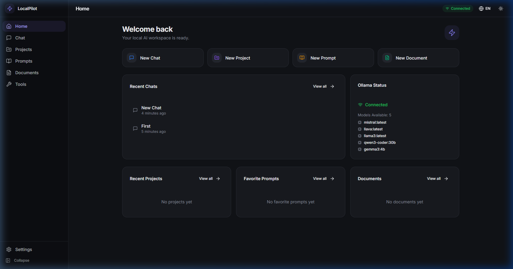

# LocalPilot

A premium local-first AI control center powered by [Ollama](https://ollama.com). Built for power users who want a polished, private, and practical desktop workspace for AI-assisted work.



## What is LocalPilot?

LocalPilot is a desktop application that brings together chat, prompt management, project organization, document workspace, and quick AI tools — all powered by your local Ollama instance. No cloud dependencies, no authentication, no tracking. Your data stays on your machine.

### Key Features

- **Chat** — Full-featured chat workspace with streaming responses, markdown rendering, code highlighting, model selection, system prompts, and conversation management
- **Prompt Library** — Create, organize, favorite, and reuse prompt templates with categories and tags
- **Projects** — Organize work into projects with linked chats, prompts, and documents
- **Documents** — Create and edit text documents with AI actions (summarize, rewrite, explain, bulletize)
- **Quick Tools** — 7 practical AI tools: Summarize, Rewrite, Translate, Explain Simply, Generate Email, Generate Social Post, Clean Up Notes
- **Overlay Popup** — Quick access panel (Ctrl+K) for fast AI interactions
- **Bilingual** — Full English and Swedish localization with live switching
- **Dark & Light** — Two polished themes with instant switching
- **Local Persistence** — SQLite storage in Tauri, localStorage fallback for dev mode

### Design Philosophy

- Local-first and privacy-respecting
- Calm, intelligent, focused UI
- Premium desktop-quality design
- Clean architecture ready for open-source contribution
- No noisy gimmicks, no placeholder-heavy mockups

## Tech Stack

| Layer | Technology |
|-------|-----------|
| Desktop Shell | [Tauri 2](https://tauri.app) |
| Frontend | [React 19](https://react.dev) + [TypeScript](https://typescriptlang.org) |
| Build | [Vite 7](https://vite.dev) |
| Styling | [Tailwind CSS 4](https://tailwindcss.com) |
| Components | [shadcn/ui](https://ui.shadcn.com) |
| Icons | [Lucide React](https://lucide.dev) |
| State | [Zustand 5](https://zustand.docs.pmnd.rs) |
| Persistence | SQLite via `tauri-plugin-sql` |
| AI Backend | [Ollama](https://ollama.com) (local, `localhost:11434`) |
| Routing | [React Router 7](https://reactrouter.com) |

## Prerequisites

- [Node.js](https://nodejs.org) 18+ (LTS recommended)
- [Rust](https://rustup.rs) (required for Tauri)
- [Ollama](https://ollama.com/download) installed and running locally

## Getting Started

### 1. Install Ollama

Download and install [Ollama](https://ollama.com/download), then pull a model:

```bash
ollama pull llama3
```

Make sure Ollama is running (it runs at `http://localhost:11434` by default).

### 2. Clone and Install

```bash
git clone https://github.com/Jimmy7610/LocalPilot.git
cd LocalPilot
npm install
```

### 3. Run in Development

**Frontend only** (browser mode, uses localStorage for persistence):
```bash
npm run dev
```
Then open `http://localhost:1420`

**Full desktop app** (Tauri + SQLite persistence):
```bash
npm run tauri dev
```

### 4. Build for Production

```bash
npm run tauri build
```

The installer will be created in `src-tauri/target/release/bundle/`.

## Project Structure

```
src/
├── App.tsx                    # Main app with routing and providers
├── index.css                  # Design system (tokens, themes, animations)
├── main.tsx                   # Entry point
├── types/                     # TypeScript type definitions
├── i18n/                      # Internationalization (EN + SV)
├── store/                     # Zustand state management
│   ├── settings-store.ts      # Language, theme, model prefs
│   ├── ollama-store.ts        # Connection status, models
│   ├── chat-store.ts          # Chats and messages
│   ├── project-store.ts       # Projects
│   ├── prompt-store.ts        # Prompt templates
│   └── document-store.ts      # Documents
├── services/
│   ├── ollama.ts              # Ollama API client (streaming)
│   └── storage.ts             # SQLite + localStorage repository
├── layout/
│   ├── AppLayout.tsx           # Shell (sidebar + topbar + content)
│   ├── Sidebar.tsx             # Navigation sidebar
│   └── TopBar.tsx              # Top bar with status/controls
├── features/
│   ├── home/                   # Dashboard
│   ├── chat/                   # Chat workspace
│   ├── projects/               # Project management
│   ├── prompts/                # Prompt library
│   ├── documents/              # Document workspace
│   ├── tools/                  # Quick AI tools
│   ├── overlay/                # Quick access popup
│   └── settings/               # App settings
├── components/ui/              # shadcn/ui components
└── lib/                        # Utilities

src-tauri/
├── src/lib.rs                  # Tauri backend with SQLite migrations
├── Cargo.toml                  # Rust dependencies
├── tauri.conf.json             # Tauri configuration
└── capabilities/               # Security permissions
```

## Keyboard Shortcuts

| Shortcut | Action |
|----------|--------|
| `Ctrl+K` | Toggle overlay popup |
| `Enter` | Send message in chat |
| `Shift+Enter` | New line in chat input |

## Roadmap

- [ ] PDF document import
- [ ] Global system tray with hotkey
- [ ] RAG-style document context for chat
- [ ] Advanced prompt variables/templates
- [ ] Chat export (Markdown/JSON)
- [ ] Project templates
- [ ] Custom tool builder
- [ ] Multi-window support
- [ ] Ollama model management (pull/delete)

## License

MIT

---

Built with care for local-first AI workflows.
